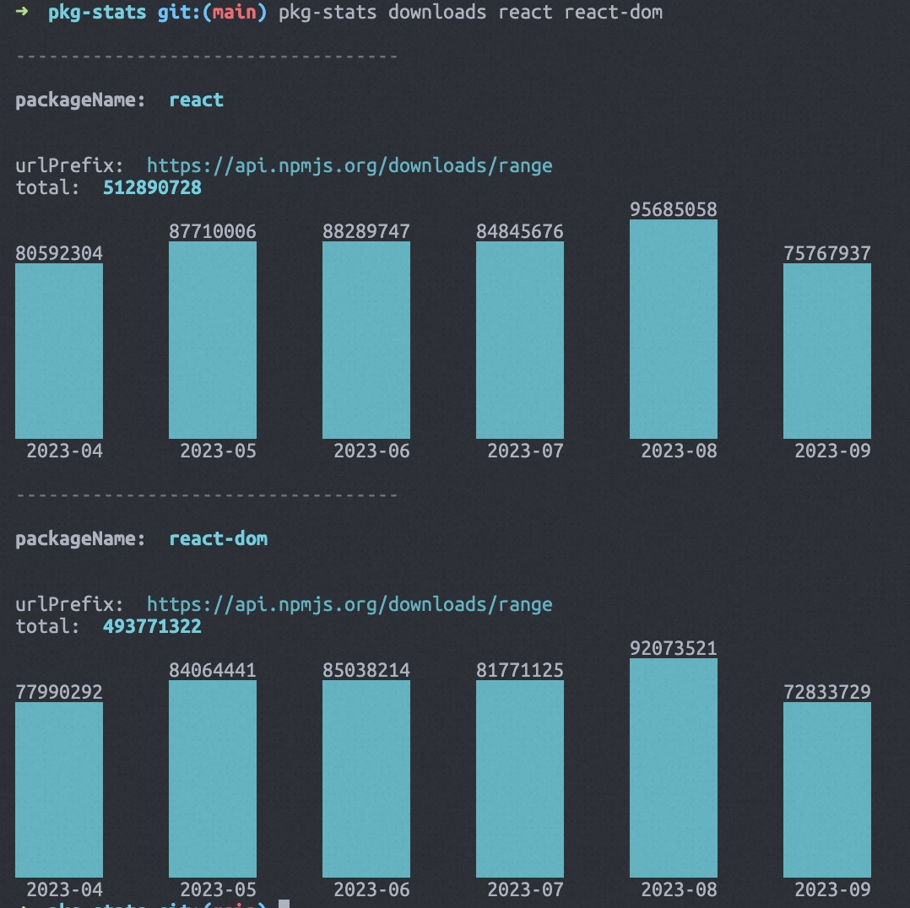

# @pkg-stats/cli

## install

```bash
npm install -g @pkg-stats/cli
```

## usage

```bash
pkg-stats downloads -h
Usage: pkg-stats downloads [options] <packageName...>

npm package stats: downloads

Arguments:
  packageName                    must have a package name

Options:
  -s, --startDate <date>         must have a start date, format: YYYY-MM-DD
  -e, --endDate <date>           must have a end date, format: YYYY-MM-DD
  -p, --urlPrefixes [prefix...]  must have a format
  -m, --merge                    is merge prefix
  -h, --help                     display help for command
```

## example

```bash
pkg-stats downloads react react-dom
```

output:




